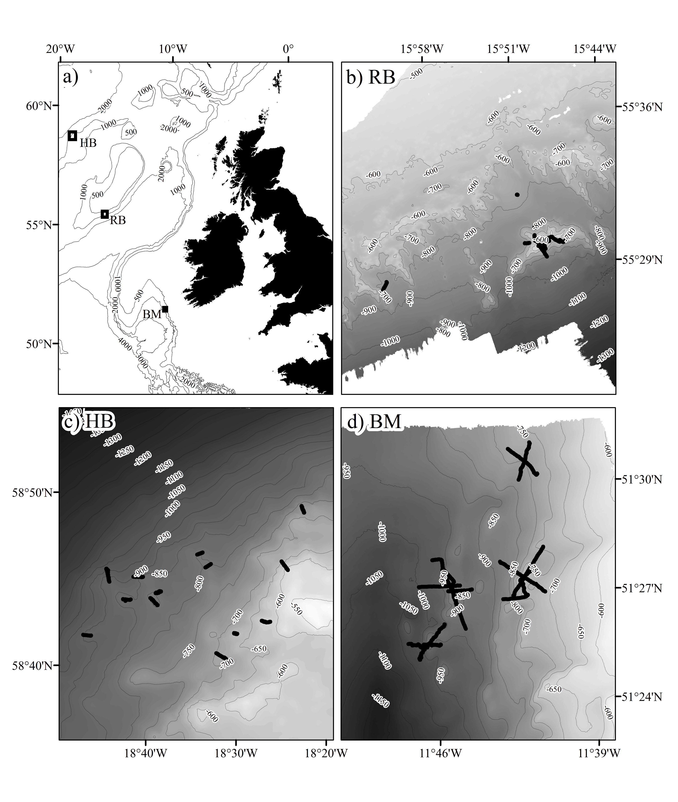
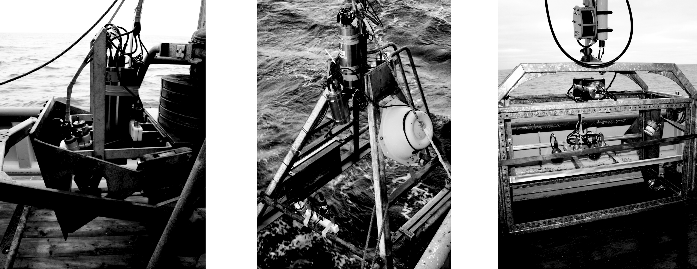
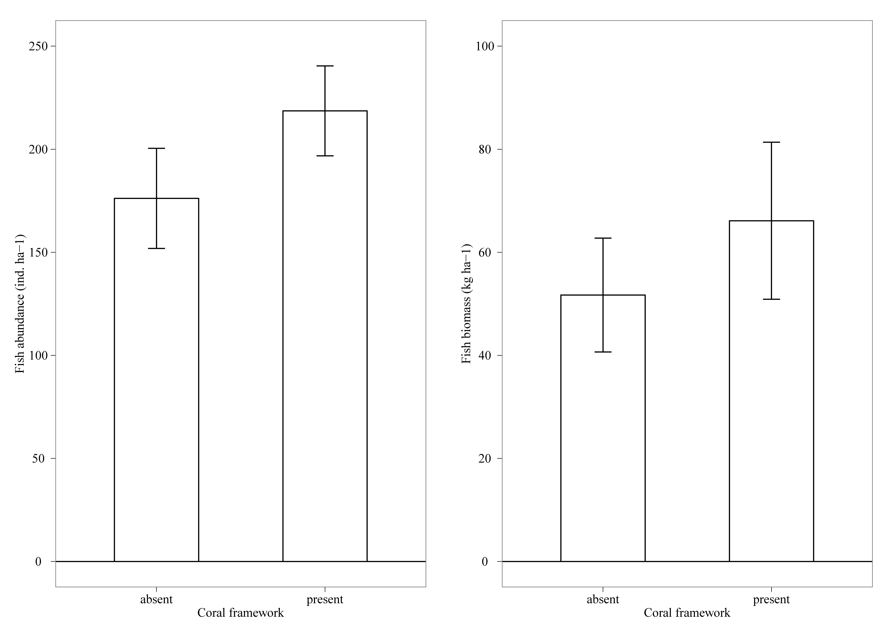
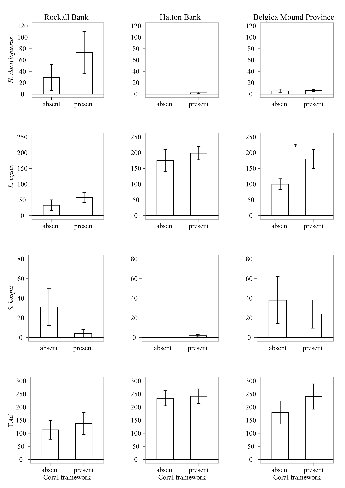
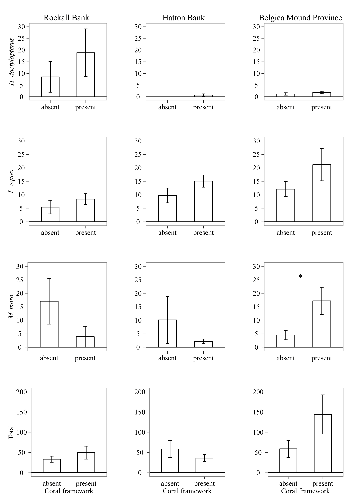

```{r setup, include=FALSE}
knitr::opts_chunk$set(cache=FALSE, echo=FALSE, warning=FALSE, message=FALSE, comment=NA,
                      fig.align="center")
```

### Abstract

Cold-water corals (CWC) can form complex three-dimensional structures that can support a diverse macro- and megafaunal community. These reef structures provide important biogenic habitats that can act as refuge, feeding, spawning and nursery areas for fish. However, quantitative data assessing the linkage between CWC and fish are scarce. The North Atlantic Ocean is a key region in the worldwide distribution of *Lophelia pertusa*, which is thought to be the most widespread frame-work forming cold-water coral species in the world. This study examined the relationship between fish and CWC reefs in the northeast Atlantic Ocean by means of video and remotely sensed data from three different CWC communities (Rockall Bank, Hatton Bank and the Belgica Mound Province). Using a tethered camera system, 37 transects were recorded during a period of 8 years. Fish-coral association was investigated using a generalized linear modelling (GLM) approach. Overall, *Lepidion eques* was the most abundant fish species present (143 ind. ha-1). Other common species were *Sigmops bathyphilus* (17 ind. ha-1), *Synaphobranchus kaupii* (15 ind. ha-1), *Helicolenus dactylopterus* (16 ind. ha-1) and *Mora moro* (7 ind. ha-1). The highest fish biomass was measured for *Lophius piscatorius* (26.3 kg ha-1). Other species with a high biomass were *Helicolenus dactylopterus* (4.3 kg ha-1), *Lepidion eques* (13.2 kg ha-1) and *Mora moro* (7.8 kg ha-1). Overall, no significant difference in fish abundance and biomass was found at coral framework habitats compared to non-coral areas. The relationship between fish and coral framework varied among fish species and study site. Fish count and length modelling results showed that terrain variables explain a small proportion of the variation of our data. Depth, coral-framework and terrain rugosity were generally the most important explanatory variables, but this varied with species and study site.

**Keywords:** Atlantic Ocean, cold-water corals, coral framework, deep-sea, demersal fish, fish abundance, fish biomass, GLM, habitat association, *Lepidion eques*, *Lophelia pertusa*, *Lophius piscatorius*, terrain analysis, video survey, zero-inflation model

### 1. INTRODUCTION

The anthropogenic impact on the deep-sea environment and its inhabiting species is steadily increasing (e.g. fisheries, gas/oil exploration, deep-sea mining) [@Davies2007], thereby raising the need for suitable management and protection of important and vulnerable habitats and species. Effective management involves decision making using scientific data on the distribution and functioning of biological communities.

In contrast to the well-studied and protected shallow tropical reefs, deep water reefs composed of framework-forming cold-water corals are relatively unknown ecosystems which have been given limited protection [@Roberts2006a]. Cold-water coral (CWC) reefs are reported to be as diverse as shallow reefs [@Jensen1992] but are also highly vulnerable to disturbance by fishing gear [@Fossa2002]. The Northeast Atlantic Ocean contains ample suitable habitat for the colony-forming cold-water coral species Lophelia pertusa and most of its distribution records originate from this region [@Davies2011a; @Davies2008]. In many places in the NE Atlantic, CWCs form complex three-dimensional reef structures. Off Norway these structures may attain lengths of hundreds of metres and heights greater than 10 m. In other places, CWCs form dense layers of framework on top and slopes of giant carbonate mounds [@Masson2003].

Deep-water fish species are characterised by extreme longevity, late age of maturity, slow growth and low fecundity [@Koslow2000]. In combination with the tendency of some species to aggregate near topographic features, such as cold-water coral reefs or seamounts, deep-water fish are particularly vulnerable to fishing activity and disturbance [@Koslow2000; @Lindholm2001]. Understanding the association between fish species and particular types of benthic habitats is crucial to predict species responses to the loss or disturbance of these habitats [@Matias2011]. Many deep-sea fishes exhibit facultative habitat use [@Auster1995] and CWC structures are thought to act as refuge, feeding, spawning and nursery areas for these species [@Buhl-Mortensen2010]. In addition CWC reefs form a habitat for a rich macro- and megafaunal community, which may represent feeding grounds for fish [@Jonsson2004a]. Several studies have reported on the relationship between CWC habitats and fish [@Auster2007a; @Costello2005; @DOnghia2010a; @DuranMunoz2011; @Husebo2002; @Soeffker2011a], with some of them providing evidence for the hypothesis that CWC habitats support a higher fish species richness and abundance [@Costello2005; @DOnghia2010a; @DuranMunoz2011]. However, previous studies lack estimates of fish abundance or biomass per unit surface area and evidence-based explanations for their observations. This hampers comparisons between datasets and importantly the implementation of data in food web and energy flow models [@VanOevelen2009a]. Such models are essential to validate importance of CWC habitats in the carbon flow through deep-water ecosystems, and estimation of their productivity.

In the following, we present one of the largest series of visual surveys with a tethered camera collated for CWC habitats. The series was collected during 6 research cruises over a period of 8 years. The data consist of abundance and biomass estimates of fish per unit area and is used to explore associations of deep-sea fish within three principal CWC sites in the NE Atlantic (Rockall and Hatton Bank, and the Belgica Mound Province). We compare the abundance and biomass of fish both within and outside CWC habitat, as well as determine the factors that drive the variation of fish count and length over different spatial scales within each site by using a modelling approach.

### 2. MATERIALS AND METHODS

#### 2.1 Study sites

Three different sites with cold-water corals in the Northeast (NE) Atlantic Ocean were surveyed for this study, Rockall Bank, Hatton Bank and the Belgica Mound Province (Fig. 1). Each site is characterised by presence of the primary framework-forming cold-water coral *Lophelia pertusa* and limited occurrences of the secondary framework-forming species *Madrepora oculata*.

```{r, out.width = "800px"}

```

**Fig. 1.** (a) Map of the study area in the North-east Atlantic with the three sampling sites indicated. (b) Close-up of Rockall Bank with tracks of video surveys made on Haas
Mound and non-coral areas. (c) Close-up of Hatton Bank with video tracks indicated. (d) Close-up of Belgica Mound Province with video tracks on mounds and off-mound
area indicated.

Rockall Bank (RB) lies to the west of Scotland in the NE Atlantic. The south-eastern flank contains a region known as the Logachev Mounds, consisting of a complex of giant carbonate mounds many of which are several hundred metres in height [@Kenyon2003]. The mounds occur at depths of 550 to 900 m and are composed of mud and coral debris with a dense cover of coral framework both alive and dead. The Logachev Mounds have been subject of a number of geological and biological studies, which showed that food supply of corals living on top of the mounds are linked with internal waves and tidal currents [@Masson2003; @Mienis2007a]. Video surveys for this study were concentrated on one of the largest mounds in this complex, Haas Mound. This isolated structure consists of two coalescent mounds each approximately 300 m high with a flat summit at a depth of 550 m. A shallow trench separates the two summits. Haas Mound is characterised by dense coverage of cold-water corals, while the seafloor of the plain to the north and the slope south of Haas Mound are relatively smooth and featureless with occasional drop stones and boulders. In total 4 video transects were recorded in the coral area of Haas Mound (2 on the summit, and 2 on the slope). For comparison 5 video transect were taken from non-coral areas (2 in the surroundings of Haas Mound, two transects from the gully area 7 miles southwest of Haas Mound and one transect on the plain north of Haas Mound) (Fig. 1b).

Hatton Bank (HB) is a large bank and is situated to the northwest of Rockall Bank. It is an important deep-sea fishing area (e.g. deep-sea sharks) and in the past it has been target of unregulated trawling and long-lining [@DuranMunoz2011]. Several studies [@Roberts2008; @Wheeler2007a] mention the presence of coral carbonate mounds on Hatton Bank. What was known about the distribution of corals on HB prior to this study is based on a series of still photographs principally taken for geological surveys [@Roberts2008], live corals collected by dredging [@Spiro2000] and occasional collection by trawling and long-lining [@DuranMunoz2011]. It is difficult to assess the abundance and distribution of CWCs from these types of data. In fact, sites on the shallow part of Hatton Bank, where @Roberts2008 reported live *Lophelia pertusa*, did not show any living specimens in the present video surveys. Our survey showed that HB has a gentle slope with numerous basaltic outcrops on its shallow part around a depth of 600-700 m and its deeper part around a depth of 780-880 m. A relatively featureless plain separates these two areas of topographic relief. No carbonate mounds were found similar to the Logachev Mounds on Rockall Bank. Most video’s (10 transects) were concentrated on the Low Knoll area. In addition, 5 transects focused on the High Knoll area and 2 transects on the steeper slope deeper than 890 m (Fig. 1c).

The Belgica Mound Province (BMP) is located on the eastern side of the Porcupine Seabight, approximately 70 nautical miles west of the Irish coast. More than 60 carbonate mounds have been discovered in this region so far [@Huvenne2002], which occur at a water depth of 550-1225 m [@DeMol2002a; @VanRooij2003]. A review of the information on this area can be found in @Foubert2005. Most of the mounds are barren with only dead scleractinian corals being present. However, the two adjacent mounds Galway and Therese Mound are known for their dense aggregation of living *Lophelia pertusa* framework [@Beyer2003; @Wheeler2007a]. Video transects have been concentrated on these two coral mounds, Galway Mound (4 transects) and Therese Mound (2 transects). For comparison with the coral area two non-coral areas at a similar depth where also surveyed, Poseidon mound (3 transects) and an off-mound area 3 miles north of Poseidon Mound (2 transects) (Fig. 1d). BMP lies within the exclusive economic zone (EEZ) of Ireland and has been designated a Special Area of Conservation (SAC) [@NPWS2011].

In total, 37 video transects were analysed for this study, 9 video transects from Rockall Bank, 17 from Hatton Bank, and 11 from Belgica Mound Province (Table 1). These were recorded during 6 research cruises over the summer period (June – October) from 2003 – 2011. Details of the individual video transects at the three sites are summarised in Supplementary Table 1.

**Table 1.** Details of each survey region. n = number of transects. % CFW is the mean
percentage of coral framework (dead and alive). SR = species richness.

Region                 | n  | Survey area (m2) | Mean depth (m) | CFW (%) | No. of fish | SR 
---------------------- | -- | ------------- | ------------- | ----------- | ----------- | --
Rockall bank           | 9  | 25,224 | 652 | 70.24 | 294 | 10
Hatton bank            | 17 | 32,546 | 763 | 71.72 | 793 | 11
Belgica Mound Province | 11 | 59,781 | 845 | 21.07 | 1198 | 12
**Total**              | 37 | 117,551 | 781 | 47.89 | 2284 | 13

#### 2.2 Tethered camera system

Up to 2010, the tethered camera system had a downward facing digital video camera connected to a recording unit and a data modem for transfer of images to the ship. This system was either mounted on a custom-made drop-frame or on a box-corer (Fig. 2a & 2b). In both configurations the frame held an underwater light source (2 x 50 W) and a set of parallel green laser pointers that marked a fixed distance (30 cm). This allowed accurate estimations of path width and fish size. The video system was gently lowered to ca. 2-3 m above seafloor on a 10 km Kevlar cable with a conductive copper core using a Kley-France winch on the RV Pelagia. This cable allowed a restricted transmission rate of images to the winch operator on deck, who maintained the height (2-3 m) above the seabed as the system was towed beside the ship at a maximum speed of 1 knot. In 2011 the digital camera was replaced by HD video while the Kevlar copper cable was replaced by a fibre-optic cable enabling real-time transfer of HD video to the ship. The drop-frame was also improved and the lighting upgraded to 100 W, which was necessary for the HD video (Fig. 2c). The live-video feed to the winch operator and observer allowed better control of the movement and distance of the system above the seafloor. This resulted in a significant improvement of video quality compared to earlier video records.

```{r, out.width = "800px"}

```

**Fig. 2.** (a) The digital video camera system used during video surveys in 2006, 2008 and 2010. (b) The same camera system used in 2009 mounted on a drop frame. (c) The HD camera system with optical cable as used during video surveys in 2011.

#### 2.3 Video Analysis

Time, depth and the position of the research vessel were recorded with the on-board GPS and echo sounder system at 1-minute intervals during each video transect. The video recordings were divided into 1-minute subsections and the distance covered within each subsection was calculated based on the position records of the research vessel. The path width was calculated every minute (RB 2006, HB 2008 and BMP 2011) or every 5 minutes (BMP 2009 and 2010) by measuring the surface areas of still frame grabs using the open-source software ImageJ, with the points from the scaling lasers acting as a reference. For videos where no lasers were available (RB 2003 and 2005), transect area was estimated by using the average path width from all other transects (2.16 m ± 0.026 S.E.). Multiplying the distance traversed by the width of field allowed the estimation of the video surface area for each subsection. Coverage of coral-framework (CFW) (dead & alive) was estimated by measuring their respective surface areas in still frame grabs with the image analysis software ImageJ. Frame grabs were taken on a regular interval, which varied between surveys (10s, 30s, 1min or 5min). For stations where frame grabs were taken more frequent than the time interval of the subsection, the average percentage of CFW was calculated per subsection. For stations where frame grabs were taken less frequent than the time interval of the subsection, the same percentage of CFW was assumed for subsections that fell within the same frame grab.

The number of fish was counted within each subsection, the time of fish encounter was recorded and frame grabs were taken to allow identification and length measurement with ImageJ using the distance between the two laser points as a length reference. The fish observed were identified based on morphological characteristics, such as size and form of the body, head and fins, colour patterns and behaviour (movement). Identification of fish species observed during the latest HD videos helped to re-assess and confirm the identification of previously identified fish from pre-2011 data. The identification of fish and coral species was also verified by dredge and trawl samples collected during cruises at each region. Fish were identified to species level, in order to allow a suitable comparison of sites and make the calculation of a biomass estimate possible.

Absolute abundance estimates were calculated for each fish species per transect using the number of individuals observed and the calculated sampling area. Weights of 10 fish species were estimated from length measurements using length-weight relationships [@Anderson1996]. The mean intercept (a) and slope (b) value for each of the 10 fish species was calculated from records obtained from FishBase (www.fishbase.org) (Supplementary Table 2). The fish biomass (kg per hectare) for each of the 10 species was calculated per transect using the total weight of the fish species and the sampling area.

#### 2.4 Multibeam data and digital terrain analysis

Bathymetric surveys were conducted at all three study sites using RV Pelagia’s hull-mounted Kongsberg-Simrad EM300 multi-beam echosounder at 30 kHz in order to identify suitable sampling locations. Multibeam data was collected during three research cruises from 2006 – 2009 (RB = 2006, HB = 2008 and BMP = 2008, 2009). Multibeam data for RB was processed to a 20 m grid resolution, while the data for HB & BMP was processed to a 50 m grid resolution. Thus, to maintain comparison the multibeam data of RB was re-sampled to a 50 m grid resolution.

The processed depth values from the multibeam data were used for digital terrain analysis using a geographical information system (ArcGIS 10, ESRI Software). The Benthic Terrain Modeler (BTM) extension [@Wright2005] and DEM Surface Tools [@Jenness2012) were used to calculate the following topographic variables: aspect, bathymetric position index, longitudinal curvature, tangential curvature, profile curvature, roughness, rugosity, slope, terrain ruggedness index and topographic position index [@Wilson2007a]. Aspect is defined as the direction of maximum slope and was converted to easterly and northerly aspect [@Wilson2007a]. Slope is the maximum change in elevation within a moving window. Slope values range from zero (flat surface) to 90° (vertical surface) and were calculated using the 4 cell method [@Jenness2012]. Rugosity is the ratio of surface area to planar area and provides an index of how variable the surrounding area is within moving window [@Jenness2012]. Using this method, flat areas exhibit values of 1, while high relief areas have higher values but very rarely exceed 3. Bathymetric position index (BPI) provides a measure for a location relative to the other locations surrounding it [@Wright2005]. Positive values indicate relief such as peaks and crests, negative values indicate troughs or depressions. Values near zero represent flat areas or areas of constant slope. Two BPI variables were constructed (BPI Broad and BPI Fine). BPI Broad was constructed using annulus settings of 1 & 5 (factor of 250 for 50 m resolution), while BPI Fine was constructed using annulus settings of 1 & 3 (factor of 150 for 50 m resolution) [@Wright2005]. Longitudinal and tangential curvatures show positive values when the curvature is concave (i.e. when water would decelerate as it flows over this point). Negative values indicate convex curvature where stream flow would accelerate [@Jenness2012]. Plan curvatures are positive when the curvature is convex (i.e. when water would diverge as it flows over this point). Negative values indicate concave curvature where flow would converge; all curvatures were calculated within DEM Tools [@Jenness2012]. Terrain Ruggedness Index (TRI), Roughness and Topographic Position Index (TPI) were calculated using GDAL DEM Tools. Values at zero indicate flat areas, while higher values indicate rough and variable terrain [@Wilson2007a].

#### 2.5 Statistical analysis and generalized linear models

The mean abundance and biomass per fish species was calculated for coral and non-coral framework transects within each region. The data did not meet the assumption of normality, thus significance was tested applying a Kruskal-Wallis test using R Version 2.14.2 [@RCoreTeam2012].

A 1000 random spatial points of each study site were extracted from the digital terrain data using ArcGIS to check for co-linearity among terrain variables. Variation inflation factors (VIF) were used to detect high-dimensional co-linearity (Supplementary Table 3). High VIF values indicate a high co-linearity. Using a backward selection procedure, the variable with the highest VIF was dropped at a time and the VIF was recalculated for the remaining variables. This procedure was repeated until the variable with the highest VIF value reached a value below 5, to ensure that no co-linearity remains [@Zuur2007]. Possible non-linear correlation among remaining predictor variables was evaluated using multi-panel scatter plots together with Pearson correlation values. Variables with a high Pearson correlation value (> 0.8) were dropped. The VIF of the 6 remaining variables was checked again (Supplementary Table 3) and together with the CFW variable they were used for fish count and length modelling. Video data and digital terrain data were combined by matching the end point coordinate of each video subsection with the nearest geographical position of the digital terrain data. This was done on three different spatial scales by grouping the video data into 1 min (54.9 m-2 ± 0.95 S.E.), 5min (265.3 m-2 ± 7.4 S.E.) and 10min subsections (511.1 m-2 ± 18.5 S.E.). Generalized linear modelling (GLM) was then applied to evaluate the factors that drive the variation of fish count and length on the three scales within each study site. In order to account for the sampling effort per site when modelling fish counts, the logarithm of the survey area was used as model offset [@Zuur2012].

Fish count data was dominated by many zero observations and thus likely to be zero-inflated. We plotted count frequency plots to analyse the number of zero observations. Four different model distributions (Poisson, negative binomial, zero-inflated poisson (ZIP), zero-inflated negative binomial (ZINB)) were compared by dispersion parameters and Akaike’s Information Criteria (AIC) values of the full model (M15, Table 2) to arrive at the optimal distribution of our data (Supplementary Table 6). The model fitting for the various distributions was accomplished using the stats, MASS, mgcv and pscl packages in R Version 2.14.2 (R Development Core Team, 2012). An Information Theoretic approach was used for model selection. This involved the comparison of 15 different pre-defined models (Table 2) using the AIC. Model selection was applied to each of the three study sites on the 1 minute time scale fitting a ZINB GLM on the total fish count data. The full model was further implemented on individual counts of the three commonly observed species (Helicolenus dactylopterus, Lepidion eques and Synaphobranchus kaupii) on the smallest spatial scale (1 min) and compared with the full model of the total fish count. Model validation was done by comparing Pearson residuals with fitted values and explanatory variables.

**Table 2.** Model variables included in the different models used for model selection of fish
count and length data.

Model | Model variables
----- | ---------------
M1 | Null
M2 | Depth
M3 | CFW
M4 | Rugosity
M5 | Depth+CFW
M6 | Depth+rugosity
M7 | Depth+CFW+rugosity
M8 | Depth+CFW+BPI broad
M9 | Depth+CFW+tang curve
M10 | Depth+CFW+BPI broad+tang curve
M11 | Depth+CFW+northings+eastings
M12 | Depth+CFW+rugosity+BPI broad+tang curve
M13 | Depth+CFW+rugosity+northings+eastings
M14 | Depth+rugosity+BPI broad+tang curve+northings+eastings
M15 | Depth+CFW+rugosity+BPI broad+tang curve+northings+eastings

No biomass estimate for *S. kaupii* was available, thus the distribution of the fish length of the three most commonly found species for which biomass data was available (*H. dactylopterus*, *L. eques* and *Mora moro*), was analysed using length-frequency histograms. Poisson GLM models of the full model were fitted for each of the three species using the stats package in R, the fit of the model was checked using dispersion parameters and AIC values (Supplementary Table 8). Model validation was done by using Normal Q-Q plots, scale-location plots, Cook’s distance plot and residuals vs. fitted value plots. Again, the same 15 pre-defined models were compared for each of the three species for the three study sites on the 1 minute scale. The full model was again used to explain the length of the different fish species at the three study sites on the 1 minute scale.

### 3. RESULTS

#### 3.1 Video data

A total of 36 hours of video footage was examined from 37 transects. The total area sampled was 11.76 ha (RB = 2.52 ha, HB = 3.25 ha, BMP = 5.98 ha). Transects lasted an average of 58 minutes and covered on average a distance of 1456 m and an area of 3177 m2. The path width averaged 2.16 m (± 0.026 S.E.) and the total area of frame grabs taken from each transect averaged 54.91 m2 (± 0.95 S.E.). The average depth of RB transects was 652 m, on average HB transects were slightly deeper (763 m) and BMP transects were even deeper than HB (845 m). Overall, video surveys covered a depth range from 379 to 1030 m (RB = 534 – 861 m, HB = 379 – 961m, BMP = 398 – 1030 m). Depth varied highly within and between transects as video surveys were carried out to cover entire cold-water coral mounds.

A total of 2284 fish specimens were counted (RB = 294 individuals, HB = 793, BMP = 1198), belonging to 13 different fish species within 11 families (Supplementary Table 2). The majority of the species found were present at all three sites (Supplementary Table 4). L. eques was the most abundant fish species present (142.81 ind. ha-1 ± 16.30 S.E., n = 1542 individuals) and made up to 67.5 % of all the individuals observed. Other common species were *Sigmops bathyphilus* (17.20 ind. ha-1 ± 4.16 S.E., n = 157), S. kaupii (14.69 ind. ha-1 ± 5.33 S.E., n = 148), *H. dactylopterus* (16.15 ind. ha-1 ± 7.71 S.E., n = 209) and M. moro (6.65 ind. ha-1 ± 1.01 S.E., n = 95). A number of less common fish species were observed including Brosme brosme, Chimaera chimaera, Hoplostethus atlanticus, Lophius piscatorius, Molva dypterygia, Phycis phycis, Pseudotriakis microdon and Raja fyllae. The highest fish biomass was measured for L. piscatorius (26.30 kg ha-1 ± 10.70 S.E.) due to its size. Other species with a high biomass were H. dactylopterus (4.28 kg ha-1 ± 2.06 S.E.), L. eques (13.19 kg ha-1 ± 1.81 S.E.) and M. moro (7.83 kg ha-1 ± 1.87 S.E.).

Within sites, *L. eques* was the most abundant species at HB and BMP and the second most abundant species at RB. At RB *H. dactylopterus* was the most abundant species. *S. bathyphilus* was the second most abundant species at HB and *S. kaupii* was the second most abundant species at BMP (Supplementary Table 4). *L. piscatorius* showed the highest fish biomass at BMP and *L. eques* showed the second highest biomass. At HB the highest biomass was estimated for *L. eques* and the second highest biomass for *B. brosme*. At RB the highest biomass was measured for *H. dactylopterus*, closely followed by *M. moro* (Supplementary Table 5). Total fish abundance was highest at HB, at BMP it was slightly lower, while the fish abundance of RB was half as much as HB (Supplementary Table 4). However, total fish biomass was highest at BMP, being three times as much as for the other two regions. RB and HB fish biomass was fairly similar, with HB being slightly lower (Supplementary Table 5).

Fish species richness was highest in the BMP, the region with the largest survey area (5.98 ha), with 12 species recorded, 11 at HB (3.25 ha) and 10 at RB (2.52 ha) (Supplementary Table 4). 9 of the 13 species found, occurred at all three study sites. *H. atlanticus* occurred only at HB and the BMP, while *R. fyllae* occurred only at RB and the BMP. *B. brosme* was the only species that occurred solely at Hatton Bank, while *P. phycis* was only observed in the BMP (Supplementary Table 4).

#### 3.2 Fish-coral association

Overall, when data from all three sites was combined, there was a higher fish abundance and biomass associated with coral framework than with non-coral habitat (Fig. 3). But, the relationship between fish abundance, biomass and the presence and absence of coral-framework varied among fish species and study site (Fig. 4 & 5).

```{r, out.width = "500px", out.align="center"}

```

**Fig. 3.** Total fish abundance (ind. ha^-1^) and biomass (kg ha^−1^) for coral and non-coral framework patches. Error bars indicate ± S.E.; * = p < 0.05 (Kruskal–Wallis Test).

Total fish abundance and biomass per region (RB, HB & BMP) showed no significant difference between coral and non-coral framework habitats (Fig. 4 and 5). *Lepidion eques* showed a significantly higher abundance at coral framework patches at BMP (Kruskal-Wallis, p < 0.05) (Fig. 4). *Helicolenus dactylopterus* was primarily observed at RB, commonly sitting relatively motionless on top of corals. However, no significant difference in abundance and biomass between coral and non-coral habitats was found (Fig. 4 and 5). *Synaphobranchus kaupii* was mostly observed on sandy patches without coral framework, usually actively swimming close to the seafloor, but again no significant difference in abundance between coral and non-coral framework habitats was observed (Fig. 4). *Mora moro* showed a significantly higher biomass at non-coral habitats at the BMP (Kruskal-Wallis, p < 0.05) (Fig. 5). *Brosme brosme* was only observed at HB, where it solely occurred at coral framework habitats (Table 3), resulting in a highly significant relationship (Kruskal-Wallis, p < 0.01, n = 11 individuals). *Phycis phycis* (n = 1) and *Raja fyllae* (n = 4) were also only observed at areas, where coral framework was present (Table 3). *L. eques*, *M. moro* and *Chimaera monstrosa*, occurred at coral-framework and non-coral habitats at all three study sites (Table 3).

```{r, out.width = "800px"}

```

**Fig. 4.** Fish abundance (ind. ha^−1^) of several species for coral and non-coral framework patches of the three study sites. Error bars indicate ± S.E.; * = p < 0.05 (Kruskal–
Wallis Test).

```{r, out.width = "800px"}

```

**Fig. 5.** Fish biomass (kg ha^−1^) of several species for coral and non-coral framework patches of the three study sites; Error bars indicate ± S.E.; * = p < 0.05 (Kruskal–
Wallis Test).

**Table 3.** Absence and presence of all fish species within coral and non-coral framework patches at the three study sites.

| Study site       | RB        |               | HB        |               | BMP       |           
|------------------|-----------|---------------|-----------|---------------|-----------|--------------------
| **Fish species** | **Coral** | **Non-coral** | **Coral** | **Non-coral** | **Coral** | **Non-coral**
| Brosme brosme | | | √ | | | 
| Chimaera monstrosa | √ | √ | √ | √ | √ | √ 
| Helicolenus dactylopterus | √ | √ | √ |  | √ | √ 
| Hoplosthetus atlanticus | | | √ | | | √ 
| Lepidion eques | √ | √ | √ | √ | √ | √ 
| Lophius piscatorius | √ | | | √ | √ | √ 
| Molva dypterygia | √ | | √ | √ | √ | √ 
| Mora moro | √ | √ | √ | √ | √ | √ 
| Phycis phycis | | | | | √ | 
| Pseudotriakis microdon | | √ | √ | | √ | 
| Raja fyllae | | √ | | | |  √  
| Sigmops bathyphilus | | √ | √ | √ | √ | √  
| Synaphobranchus kaupii | √ | √ | √ | | √ | √ 
| **Species richness** | 7 | 8 | 10 | 6 | 9 | 11 

#### 3.3 Modelling

Frequency plots of the fish counts in the three study sites indicate that our data is indeed zero-inflated. Model comparison shows that Poisson GLM, NB GLM, Poisson GAM and NB GAM models are over-dispersed, while the zero-inflated NB GLM model was not (Supplementary Table 6). On the 5 min and 10 min scale there were not enough data points, so zero-inflated modelling was not possible for the full model (M15), as it contained too many explanatory variables (Depth, CFW, Rugosity, BPI Broad, Tang Curve, Northings & Eastings). Comparison of the 15 pre-defined models on total fish count for the three study sites showed that M15 provides the best fit for RB, explaining 9.1 % of the variation in the data. depth, CFW, Northings and Eastings provide the best fit for HB (M11), explaining 1.5 % of the variation in the data. depth, CFW, rugosity, BPI Broad and Tang Curve provide the best fit for the BMP (M12), explaining 3.2 of the variation in the data. This showed that depth, CFW and rugosity were the most important factors explaining the variation within our data, however only a minor fraction of the variation in our data could be explained. The coefficients and their significance to the zero and count model component of the full model (M15) varied with fish species and study site. All variables had a significant relationship with fish count in at least one of the models. Total fish count showed a significant relationship with CFW and Rugosity at all three study sites, but parameter values varied between sites thus proving no clear relationship. Depth only contributed significantly to the count model at RB, the region with the smallest depth range, showing a slightly positive relationship (Table 4). *S. kaupii* showed a strongly significant negative relationship with CFW at RB and BMP, but a slightly significant positive relationship with CFW at HB. *L. eques* and *H. dactylopterus* showed varying significant relationships between the three study sites (Table 4).

**Table 4.** Parameter values ± S.E. and p values for significant variables in (parentheses) for both model components (zero & count) of the full model (M 15) of individual fish counts of three common species (*H. dactylopterus*, *L. eques*, *S. kaupii*) and total fish count for all study sites.

| Fish taxa | Variable | RB—Zero   | RB—Count   | HB—Zero   | HB—Count   | BMP—Zero   | BMP-Count
|-----------|----------|-----------|------------|-----------|------------|------------|-------------
| *H. dactylopterus* | Intercept | -23.81 ± 16.53 | 11.74 ± 8.09 | -250.35 ± 2042.82 | 157.9 ± 579.9 | 34.51 ± 32.14 | -10.76 ± 12.34 
| | Depth | 0.03 ± 0.02 | 0.03 | -0.42 | -0.14 ± 0.004 **(< 0.001)** | -0.01 | -0.004
| | CFW | -0.007 ± 0.02 | 0.002 ± 0.005 | 0.015 ± 0.06 | 0.02 ± 0.02 | -0.06 ± 0.02 **(< 0.001)** | -0.02
| | Rugosity | 33.7 ± 14.39 **(0.02)** | 3.06 ± 8.6 | -26.67 ± 2056.47 | -254.9 ± 583.1 | -44.49 ± 32.58 | 1.47 ± 11.28
| | BPI broad | 0.002 ± 0.004 | -0.002 ± 0.001 **(0.05)** | 0.02 ± 0.02 | 0.02 ± 0.004 **(< 0.001)** | 0.0001 ± 0.001 | 0.001 ± 0.0006 **(0.01)**
| | Tang curve | -2.57 ± 3.01 | -0.12 ± 0.97 | 71.07 ± 146.47 | -43.63 ± 27.52 | 8.78 ± 11.05 | -5.17 ± 4.37 
| | Northings | -0.86 ± 0.65 | -0.05 ± 0.17 | -1.95 ± 33.18 | .0,81 ± 3.37 | 0.06 ± 0.82 | -0.55 ± 0.41
| | Eastings | -0.29 ± 0.62 | -0.09 ± 0.16 | -5.8 ± 21.1 | -1.35 ± 6.06 | -3.48 ± 0.76 **(< 0.001)** | -1.56  ± 0.38 **(< 0.001)**
| *L. eques* | Intercept | −15.93 ± 9.87 | −11.72 ± 3.04 **(< 0.001)** | 143.8 ± 110.4 | 39.4 ± 23.87 | −8.6 | −19.41 ± 2.7 **(< 0.001)**
| | Depth | −0.01 ± 0.005 **(0.05)** | −0.003 ± 0.002 | −0.001 ± 0.002 | 0.002 | −0.003 | −0.004
|  | CFW | −0.01 ± 0.009 | −0.0006 ± 0.005 | 0.01 ± 0.005 **(0.04)** | 0.004 ± 0.001 **(< 0.001)** | −0.01 ± 0.008 | 0.0005 ± 0.002
|  | Rugosity | 4.26 ± 7.15 | 4.45 ± 2.88 | −150.3 ± 111 | −41.89 ± 23.85 | 0.49 ± 5.23 | 11.63 ± 2.7 **(< 0.001)**
|  | BPI broad | 0.001 ± 0.002 | 0.001 ± 0.001 | −0.002 ± 0.001 **(0.03)** | −0.0005 ± 0.0002 **(0.05)** | −0.0008 ± 0.0006 | 0.0006 ± 0.0001 **(< 0.001)**
|  | Tang curve | −1.07 ± 2.69 | −0.7 ± 0.88 | −4.93 ± 8.26 | 1.19 ± 2.08 | −0.69 ± 3.49 | 0.02 ± 0.71
|  | Northings | −1 ± 0.66 | 0.21 ± 0.21 | −0.85 ± 0.32 **(0.01)** | −0.14 ± 0.09 | 0.1 ± 0.28 | 0.03 ± 0.06
|  | Eastings | 0.08 ± 0.52 | 0.24 ± 0.2 | −0.02 ± 0.33 | −0.08 ± 0.08 | 0.06 ± 0.3 | −0.02 ± 0.07
| *S. kaupii* | Intercept | −18 ± 484.28 | −14.34 ± 15.83 | −737.01 | 616 | −139.3 ± 29.28 **(< 0.001)** | −98.13 ± 21.2 **(< 0.001)**
| | Depth | 0.04 ± 0.1 | −0.006 ± 0.0003 **(< 0.001)** | 0.49 | −0.002 ± 0.007 | −0.008 ± 0.002 **(< 0.001)** | −0.01
| | CFW | −3.83 ± 8.07 | −0.14 ± 0.04 **(0.001)** | 5.12 ± 1.01 **(< 0.001)** | 0.2 ± 0.09 **(0.03)** | −0.01 ± 0.01 | −0.02 ± 0.009 **(0.008)**
| | Rugosity | 4.65 ± 398.78 | 3.65 ± 15.85 | 911.3 | −631.8 | 128.8 ± 28.85 **(< 0.001)** | 82.16 ± 20.91 **(< 0.001)**
| | BPI broad | 0.69 ± 1.35 | 0.02 ± 0.007 **(0.006)** | −0.06 ± 0.01 **(< 0.001)** | −0.003 ± 0.002 | 0.004 ± 0.002 **(0.018)** | 0.002 ± 0.002
| | Tang curve | −6.11 ± 238.01 | 0.23 ± 4.91 | −25.2 ± 144.97 | 103.9 ± 47.56 **(0.03)** | −16.7 ± 4.8 **(< 0.001)** | −11.38 ± 4.25 **(0.007)**
| | Northings | 44.12 ± 89.48 | 2.98 ± 0.8 **(< 0.001)** | −146.81 ± 40.22 **(< 0.001)** | −6.62 ± 2.75 **(0.02)** | 0.25 ± 0.26 | −0.003 ± 0.21
| | Eastings | 62.65 ± 133.95 | 3.26 ± 0.85 **(< 0.001)** | 162.93 ± 33.73 **(< 0.001)** | 8.55 ± 3.19 **(0.007)** | 0.04 ± 0.3 | 0.24 ± 0.24
| All fish species | Intercept | −132 ± 60.48 **(0.03)** | 2.59 ± 2.19 | 74.6 ± 115.4 | 41.83 ± 22.03 | −125.7 ± 15.15 **(< 0.001)** | −16.14 ± 2.66 **(< 0.001)**
| | Depth | 0.03 ± 0.02 | 0.006 ± 0.001 **(< 0.001)** | −0.0006 ± 0.002 | 0.002 | −0.038 | −0.004
| | CFW | −0.26 ± 0.12 **(0.03)** | −0.007 ± 0.003 **(0.02)** | 0.02 ± 0.006 **(0.01)** | 0.004 ± 0.001 **(< 0.001)** | −0.35 ± 0.16 **(0.03)** | −0.002 ± 0.001
| | Rugosity | 134.69 ± 63.13 **(0.03)** | −2.14 ± 2.3 | −81.4 ± 115.9 | −44.03 ± 22 **(0.05)** | 82.73 ± 21.5 **(< 0.001)** | 8.96 ± 2.7 **(< 0.001)**
| | BPI broad | −0.04 ± 0.02 | −0.0002 ± 0.0007 | −0.002 ± 0.001 | −0.0003 ± 0.0002 | 0.005 ± 0.0009 **(< 0.001)** | 0.0007 ± 0.0001 **(< 0.001)**
| | Tang curve | 66.3 ± 33.8 **(0.05)** | 0.38 ± 0.63 | −5.16 ± 9.04 | 0.5 ± 1.93 | −15.52 ± 6.08 **(0.01)** | −0.33 ± 0.68
| | Northings | −14.46 ± 7.07 **(0.04)** | 0.19 ± 0.12 | −1.09 ± 0.36 **(0.003)** | −0.11 ± 0.08 | 0.76 ± 0.6 | −0.04 ± 0.05
| | Eastings | −1 ± 2.41 | 0.06 ± 0.12 | 0.25 ± 0.35 | 0.004 ± 0.07 | −0.68 ± 0.54 | −0.008 ± 0.05

Length-frequency histograms showed a fairly normal distribution among fish length of the three species analysed (*H. dactylopterus*, *L. eques* and *M. moro*). Poisson GLM models showed no strong over-dispersion (Supplementary Table 8) and were used for further analysis. Model comparison showed that the full model was always the most explanatory model (highest % explained deviance), indicating that terrain variables made an important contribution to improve the model fit. All variables apart from BPI Broad showed a significant relationship with fish length of at least one of the models. However, none of the variables that showed a significant relationship, were persistently significant for the three species or study sites (Table 5).

**Table 5.** Parameter values ± S.E. and p values for significant variables in (parentheses) for Poisson GLM models of all three sites on fish length of the three different species (*H. dactylopterus*, *L. eques*, *M. moro*).

| Fish taxa | Variable | RB            | HB            | BMP 
|-----------|----------|---------------|---------------|---------------
| *H. dactylopterus* | Intercept | 2.13 ± 1.03 **(0.04)** | 29.33 ± 84.98 | 5.19 ± 2.17 **(0.02)**
|  | Depth | −0.0001  ± 0.001 | 0.03 ± 0.02 | 0.0005 ± 0.0005
|  | CFW | −0.001 ± 0.0009 | −0.004 ± 0.004 | 0.001 ± 0.001
|  | Rugosity | 1.04 ± 1.27 | −8.25 ± 94.43 | −1.64 ± 2.07
| | BPI broad | −0.0003 ± 0.0002 | −0.004 ± 0.004 | −0.00008 ± 0.0001
| | Tang curve | 0.15 ± 0.18 | 17.93 ± 19.18 | 0.027 ± 0.79 
| | Northings | −0.07 ± 0.03 **(0.05)** | | 0.007 ± 0.05
| | Eastings | 0.02 ± 0.03 | | −0.04 ± 0.07
| *L. eques* | Intercept | 3.93 ± 0.5 **(< 0.001)** | −9.81 ± 4.95 **(0.05)** | 3.86 ± 0.67 **(< 0.001)**
| | Depth | 0.0003 ± 0.0003 | 0.00006 ± 0.0001 | 0.0004 ± 0.0001 **(0.003)**
| | CFW | −0.0002 ± 0.0007 | 0.0005 ± 0.0003 | −0.0001 ± 0.0003
| | Rugosity | −0.47 ± 0.48 | 12.79 ± 4.97 **(0.01)** | −0.34 ± 0.64
| | BPI broad | −0.00006 ± 0.0001 | −0.00001 ± 0.00005 | 0.00003 ± 0.00003
| | Tang curve | 0.45 ± 0.16 **(0.004)** | −0.54 ± 0.46 | 0.02 ± 0.15
| | Northings | −0.03 ± 0.03 | 0.07 ± 0.02 **(0.003)** | −0.007 ± 0.01
| | Eastings | −0.07 ± 0.03 **(0.03)** | −0.03 ± 0.02 | −0.02 ± 0.01
| *M. moro* | Intercept | 28.24 ± 74.62 | 35.37 ± 26.89 | 4.16 ± 1.22 **(< 0.001)**
| | Depth | −0.005 ± 0.008 | −0.0008 ± 0.0004 | 0.00003 ± 0.00026
| | CFW | 0.003 ± 0.007 | 0.0002 ± 0.001 | 0.003 ± 0.0008 **(0.002)**
| | Rugosity | −27.73 ± 80.83 | −32.48 ± 27.03 | −0.46 ± 1.16
| | BPI broad | | −0.0003 ± 0.0002 | 0.0002 ± 0.00008
| | Tang curve | | −1.23 ± 2.79 | 0.21 ± 0.41
| | Northings | | 0.05 ± 0.1 | 0.03 ± 0.03
  
### 4. DISCUSSION

Fish abundance and biomass were variable among study sites. However, the species composition of the three sites was fairly similar, with most species occurring at all three sites. In common with previous studies in the same region [@Costello2005; Soeffker2011a] the Atlantic codling (*L. eques*) was the most abundant species in our video records, while the monkfish (*L. piscatorius*) was the species with the highest fish biomass.

No significant difference in fish abundance and biomass between coral-framework and non-coral habitats was found. However, when comparing the abundance and biomass of each species with the absence and presence of coral framework, we found a similar result to @Auster2007a in that this relationship not only depends on the biogenic habitat, but also on the fish species in question. Sightings of rockfish (*Helicolenus dactylopterus*) were often associated with coral framework, which can be explained by the fact that they are considered protection seekers [@Krieger2002]. *L. eques* is a typical bottom dwelling species swimming close to the bottom and displaying station holding behaviour [@Uiblein2003]. According to @Costello2005 it is frequent in more open transition or debris zone around coral reefs where it often hides near stones. Our results showed that *L. eques* is more abundant at coral habitats and we often observed them hiding underneath coral framework, but they also frequently occurred in non-coral areas, where they were particularly associated with boulders. The species feeds mainly on crustaceans and polychaetes [@Cohen1990] which might explain its frequent occurrence near CWC reefs as these support a higher macrofaunal biomass than surrounding soft sediments [@Jonsson2004a]. A higher abundance of *S. kaupii* was found at non-coral habitats at RB and the BMP. Our modelling results support this, as we found a significant negative relationship with CFW at those two regions at the 1 min scale (55 m^-2^). Thus, the northern cutthroat eel seems to be associated with sandy habitats.

Both count and fish length modelling results suggest a relationship with terrain variables. The outcome in our case varies with species and study site and doesn’t permit extrapolation to larger areas. The growing set of multibeam data from the world’s continental shelves and oceans, however, opens up scope for more frequent applications of terrain data in distribution studies. Incorporation of terrain variables in models of fish distributions has been earlier applied by @Moore2011 for an Australian demersal fish assemblage. By using distance-based multivariate linear modelling, they found that the variation in the fish is primarily determined by depth with distance to the reef being the second most important factor. While these results illustrate that benthic fish assemblages are influenced by geological and topographic features, biological characteristics of the seafloor can also be important factors explaining the variation in fish abundance [@Krieger2002]. Our results show that terrain variables only explain a small fraction of the variation in our data, indicating that other factors play a role in explaining fish abundance and biomass around CWC structures. Most likely prey availability, the movement of fish and physical factors, such as temperature and current velocity, need to be considered to get a better understanding of the habitat preference of certain fish species.

The behaviour of the fish species in question and possibly their life-stage and history affect the relevant spatial scale for determining coral-fish interaction [@Auster2007a]. The distribution pattern of “station holding” species such as *H. dactylopterus* involves a much smaller spatial scale, which needs to be considered in order to analyse their functional relationship with a certain habitat. By contrast, mobile species, such as C. monstrosa or sharks and rays, cover larger areas during foraging bouts which may well include CWC and non-coral habitats, and hence the relevant scale is much larger. Choosing the combination of species and survey scale has a profound impact on the outcome of any study on fish coral associations. Selection of the appropriate scale is further complicated by the heterogeneity of micro-habitats within habitats. The CWC framework at our study sites has no uniform coverage, i.e. in between coral framework there are larger and smaller open spaces with rubble or sediment. Depending on the size and mobility of the fish species studied, such spots are either very relevant or completely irrelevant in mapping and quantifying the distribution of fish habitats. We tried to consider this, by analysing the relationship between fish and cold-water corals on three different spatial scales.

During our study we also encountered technical limitations. Identification of fish species from the downward looking digital video was sometimes difficult and a small proportion of mis-identifications cannot be excluded. For biomass estimates, we used LW relationships from www.fishbase.org. Ideally, LW relationships derived from samples of fish caught at the place and time of the study should be used, as LW relations change with season and location depending on stomach fullness, gonad maturity, sex and preservation techniques [@Ozaydin2007]. For obvious reasons it was impossible to catch live fish from the coral study sites to measure weights and construct LW relationships. Using zero-inflated modelling techniques we discovered that, although this study currently presents the most extensive video survey record of CWC-fish association, more data is still required in order to implement zero-inflated modelling approaches over various spatial scales. Fish length also provides an interesting factor to analyse, however, therefore an extensive number of fish length recordings need to be available. Another confounding effect in our study is the use of videos from multiple cruises during different seasons and in multiple years, using partly different equipment.

Finally, underwater equipment (ROV, tethered camera) with visible light and sometimes also sound can affect the outcome of a study like the present one, as the light (and sound)  might attract or scare the mobile fauna [@Costello2005; @Jamieson2006; @Ryer2009; @Stoner2008a]. New observations on Rockall Bank using combined downward and forward looking cameras indicate that sharks seem to actively avoid the light circle but in other species such behaviour was not obvious. Alternatives such as baited cameras with flash or infrared illumination only provide data on scavenging species and require many drops and recoveries to match the spatial coverage of a single transect with a tethered camera. We are inclined to believe that at this stage the relatively fast-moving and quiet tethered video system is the optimal instrument to make unbiased surveys of deep-sea fauna and their habitats.

### 5. CONCLUSION

No significant difference in total fish abundance and biomass was found at coral framework habitats compared to non-coral areas in all regions jointly nor separately. The relationship between fish and coral framework varied among fish species and study site. L. eques showed a significantly higher abundance at coral framework habitats and M. moro showed a significantly higher biomass at coral framework areas.

Fish count and length modelling results showed that terrain variables explain a small proportion of the variation of our data with depth, presence of coral-framework and terrain rugosity being generally the most important explanatory variables. Even so, variables explaining variation in our data varied with species and study site. In order to further analyse the functional relationship of certain fish species with a particular habitat, more detailed studies with an in depth analysis of the habitat and the spatial scale of an organism, more replicates and a longer time-scale need to be considered. Data on fish abundance and biomass are lacking in studies on fish coral interactions published so far. Yet, there is a clear need for such data in order to derive carbon flow models of CWC habitats and provide knowledge for management and protection of cold-water coral habitats and regulate the impact of fishing activities. The first ever published model of a CWC habitat [@VanOevelen2009a] showed a substantially higher level of carbon flow and benthic biomass in the coral habitat than outside. This supports the hypothesis that CWC reefs are more productive than surrounding non-coral areas and hence could support a larger number of fish.

### Acknowledgements

We thank S. van der Wal and E. Kochen for assistance with sampling and video analysis. Thanks to Jaap van der Meer for support with the modelling approach. We also thank the crew and captain of the RV Pelagia for their help during the cruises. The research leading to these results has received funding from the European Community's Seventh Framework Programme (FP7/2007-2013) under the CoralFISH project (EC contract number 213144) and previously by the HERMES  project (EC contract GOCE-CT-2005-511234), both funded by the European Commission.

### Appendix A. Supporting information

Supplementary data associated with this article can be found in the online version at http://dx.doi.org/10.1016/j.dsr2.2013.05.022.

### References

